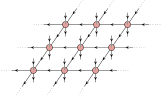
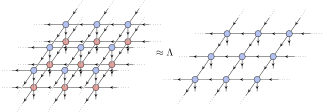

```@meta
EditURL = "../../../../examples/3d_ising_partition_function/main.jl"
```

[](https://mybinder.org/v2/gh/QuantumKitHub/PEPSKit.jl/gh-pages?filepath=dev/examples/3d_ising_partition_function/main.ipynb)
[](https://nbviewer.jupyter.org/github/QuantumKitHub/PEPSKit.jl/blob/gh-pages/dev/examples/3d_ising_partition_function/main.ipynb)
[](https://minhaskamal.github.io/DownGit/#/home?url=https://github.com/QuantumKitHub/PEPSKit.jl/examples/tree/gh-pages/dev/examples/3d_ising_partition_function)


# [The 3D classical Ising model](@id e_3d_ising)

In this example, we will showcase how one can use PEPSKit to study 3D classical statistical
mechanics models. In particular, we will consider a specific case of the 3D classical Ising
model, but the same techniques can be applied to other 3D classical models as well.

As compared to simulations of [2D partition functions](@ref e_2d_ising), the workflow
presented in this example is a bit more experimental and less 'black-box'. Therefore, it
also serves as a demonstration of some of the more internal functionality of PEPSKit,
and how one can adapt it to less 'standard' kinds of problems.

Let us consider the partition function of the classical Ising model,

```math
\mathcal{Z}(\beta) = \sum_{\{s\}} \exp(-\beta H(s)) \text{ with } H(s) = -J \sum_{\langle i, j \rangle} s_i s_j .
```

where the classical spins $s_i \in \{+1, -1\}$ are located on the vertices $i$ of a 3D
cubic lattice. The partition function of this model can be represented as a 3D tensor
network with a rank-6 tensor at each vertex of the lattice. Such a network can be contracted
by finding the fixed point of the corresponding transfer operator, in exactly the same
spirit as the [boundary MPS methods](@ref e_boundary_mps) demonstrated in another example.

Let's start by making the example deterministic and importing the required packages:

````julia
using Random
using LinearAlgebra
using PEPSKit, TensorKit
using KrylovKit, OptimKit, Zygote

Random.seed!(81812781144);
````

## Defining the partition function

Just as in the 2D case, the first step is to define the partition function as a tensor
network. The procedure is exactly the same as before, the only difference being that now
every spin participates in interactions associated to six links adjacent to that site. This
means that the partition function can be written as an infinite 3D network with a single
constituent rank-6 [`PEPSKit.PEPOTensor`](@ref) `O` located at each site of the cubic
lattice. To verify our example we will check the magnetization and energy, so we also define
the corresponding rank-6 tensors `M` and `E` while we're at it.

````julia
function three_dimensional_classical_ising(; beta, J = 1.0)
    K = beta * J

    # Boltzmann weights
    t = ComplexF64[exp(K) exp(-K); exp(-K) exp(K)]
    r = eigen(t)
    q = r.vectors * sqrt(LinearAlgebra.Diagonal(r.values)) * r.vectors

    # local partition function tensor
    O = zeros(2, 2, 2, 2, 2, 2)
    O[1, 1, 1, 1, 1, 1] = 1
    O[2, 2, 2, 2, 2, 2] = 1
    @tensor o[-1 -2; -3 -4 -5 -6] :=
        O[1 2; 3 4 5 6] * q[-1; 1] * q[-2; 2] * q[-3; 3] * q[-4; 4] * q[-5; 5] * q[-6; 6]

    # magnetization tensor
    M = copy(O)
    M[2, 2, 2, 2, 2, 2] *= -1
    @tensor m[-1 -2; -3 -4 -5 -6] :=
        M[1 2; 3 4 5 6] * q[-1; 1] * q[-2; 2] * q[-3; 3] * q[-4; 4] * q[-5; 5] * q[-6; 6]

    # bond interaction tensor and energy-per-site tensor
    e = ComplexF64[-J J; J -J] .* q
    @tensor e_x[-1 -2; -3 -4 -5 -6] :=
        O[1 2; 3 4 5 6] * q[-1; 1] * q[-2; 2] * q[-3; 3] * e[-4; 4] * q[-5; 5] * q[-6; 6]
    @tensor e_y[-1 -2; -3 -4 -5 -6] :=
        O[1 2; 3 4 5 6] * q[-1; 1] * q[-2; 2] * e[-3; 3] * q[-4; 4] * q[-5; 5] * q[-6; 6]
    @tensor e_z[-1 -2; -3 -4 -5 -6] :=
        O[1 2; 3 4 5 6] * e[-1; 1] * q[-2; 2] * q[-3; 3] * q[-4; 4] * q[-5; 5] * q[-6; 6]
    e = e_x + e_y + e_z

    # fixed tensor map space for all three
    TMS = ℂ^2 ⊗ (ℂ^2)' ← ℂ^2 ⊗ ℂ^2 ⊗ (ℂ^2)' ⊗ (ℂ^2)'

    return TensorMap(o, TMS), TensorMap(m, TMS), TensorMap(e, TMS)
end;
````

Let's initialize these tensors at inverse temperature ``\beta=0.2391``, which corresponds to
a slightly lower temperature than the critical value ``\beta_c=0.2216544…``

````julia
beta = 0.2391
O, M, E = three_dimensional_classical_ising(; beta)
O isa PEPSKit.PEPOTensor
````

````
true
````

## Contracting the partition function

To contract our infinite 3D partition function, we first reinterpret it as an infinite power
of a slice-to-slice transfer operator ``\mathbb{T}``, where ``\mathbb{T}`` can be seen as an infinite 2D
projected entangled-pair operator (PEPO) which consists of the rank-6 tensor `O` at each
site of an infinite 2D square lattice,

```@raw html
<center>

</center>
```

To contract the original infinite network, all we need to do is to find the leading
eigenvector of the PEPO ``\mathbb{T}``, The fixed point of such a PEPO can be parametrized
as a PEPS ``\psi``, which should then satisfy the eigenvalue equation
``\mathbb{T} |\psi\rangle = \Lambda |\psi\rangle``, or diagrammatically:

```@raw html
<center>

</center>
```

For a Hermitian transfer operator ``\mathbb{T}`` we can characterize the fixed point PEPS
``|\psi\rangle`` which satisfies the eigenvalue equation
``\mathbb{T} |\psi\rangle = \Lambda |\psi\rangle`` corresponding to the largest magnitude
eigenvalue ``\Lambda`` as the solution of a variational problem

```math
|\psi\rangle = \text{argmin}_{|\psi\rangle} \left ( \lim_{N \to ∞} - \frac{1}{N} \log \left( \frac{\langle \psi | \mathbb{T} | \psi \rangle}{\langle \psi | \psi \rangle} \right) \right ) ,
```

where ``N`` is the diverging number of sites of the 2D transfer operator ``\mathbb{T}``. The function
minimized in this expression is exactly the free energy per site of the partition function.
This means we can directly find the fixed-point PEPS by
[variationally minimizing the free energy](@cite vanderstraeten_residual_2018).

### Defining the cost function

Using PEPSKit.jl, this cost function and its gradient can be computed, after which we can
use [OptimKit.jl](https://github.com/Jutho/OptimKit.jl) to actually optimize it. We can
immediately recognize the denominator ``\langle \psi | \psi \rangle`` as the familiar PEPS
norm, where we can compute the norm per site as the [`network_value`](@ref) of the
corresponding [`InfiniteSquareNetwork`](@ref) by contracting it with the CTMRG algorithm.
Similarly, the numerator ``\langle \psi | \mathbb{T} | \psi \rangle`` is nothing more than an
`InfiniteSquareNetwork` consisting of three layers corresponding to the ket, transfer
operator and bra objects. This object can also be constructed and contracted in a
straightforward way, so we can again compute its `network_value`.

To define our cost function, we then need to construct the transfer operator as an
[`InfinitePEPO`](@ref), construct the two infinite 2D contractible networks for the
numerator and denominator from the current PEPS and this transfer operator, and specify a
contraction algorithm we can use to compute the values of these two networks. In addition,
we'll specify the specific reverse rule algorithm that will be used to compute the gradient
of this cost function.

````julia
boundary_alg = SimultaneousCTMRG(; maxiter = 150, tol = 1.0e-8, verbosity = 1)
rrule_alg = EigSolver(;
    solver_alg = KrylovKit.Arnoldi(; maxiter = 30, tol = 1.0e-6, eager = true), iterscheme = :diffgauge
)
T = InfinitePEPO(O)

function pepo_costfun((peps, env_double_layer, env_triple_layer))
    # use Zygote to compute the gradient automatically
    E, gs = withgradient(peps) do ψ
        # construct the PEPS norm network
        n_double_layer = InfiniteSquareNetwork(ψ)
        # contract this network
        env_double_layer′, info = PEPSKit.hook_pullback(
            leading_boundary,
            env_double_layer,
            n_double_layer,
            boundary_alg;
            alg_rrule = rrule_alg,
        )
        # construct the PEPS-PEPO-PEPS overlap network
        n_triple_layer = InfiniteSquareNetwork(ψ, T)
        # contract this network
        env_triple_layer′, info = PEPSKit.hook_pullback(
            leading_boundary,
            env_triple_layer,
            n_triple_layer,
            boundary_alg;
            alg_rrule = rrule_alg,
        )
        # update the environments for reuse
        PEPSKit.ignore_derivatives() do
            PEPSKit.update!(env_double_layer, env_double_layer′)
            PEPSKit.update!(env_triple_layer, env_triple_layer′)
        end
        # compute the network values per site
        λ3 = network_value(n_triple_layer, env_triple_layer)
        λ2 = network_value(n_double_layer, env_double_layer)
        # use this to compute the actual cost function
        return -log(real(λ3 / λ2))
    end
    g = only(gs)
    return E, g
end;
````

There are a few things to note about this cost function definition. Since we will pass it to
the `OptimKit.optimize`, we require it to return both our cost function and the
corresponding gradient. To do this, we simply use the `withgradient` method from Zygote.jl
to automatically compute the gradient of the cost function straight from the primal
computation. Since our cost function involves contractions using `leading_boundary`, we also
have to specify exactly how Zygote should handle the backpropagation of the gradient through
this function. This can be done using the [`PEPSKit.hook_pullback`](@ref) function from
PEPSKit.jl, which allows to hook into the pullback of a given function by specifying a
specific algorithm for the pullback computation. Here, we opted to use an Arnoldi method to
solve the linear problem defining the gradient of the network contraction at its fixed
point. This is exactly the workflow that internally underlies [`PEPSKit.fixedpoint`](@ref), and
more info on particular gradient algorithms can be found in the corresponding docstrings.

### Characterizing the optimization manifold

In order to make the best use of OptimKit.jl, we should specify some properties of the
manifold on which we are optimizing. Looking at our cost function defined above, a point on
our optimization manifold corresponds to a `Tuple` of three objects. The first is an
`InfinitePEPS` encoding the fixed point we are actually optimizing, while the second and
third are `CTMRGEnv` objects corresponding to the environments of the double and triple
layer networks ``\langle \psi | \psi \rangle`` and ``\langle \psi | T | \psi \rangle``
respectively. While the environments are just there so we can reuse them between subsequent
contractions and we don't need to think about them much, optimizing over the manifold of
`InfinitePEPS` requires a bit more care.

In particular, we need to define two kinds of operations on this manifold: a retraction and
a transport. The retraction, corresponding to the `retract` keyword argument of
`OptimKit.optimize`, specifies how to move from a point on a manifold along a given descent
direction to obtain a new manifold point. The transport, corresponding to the `transport!`
keyword argument of `OptimKit.optimize`, specifies how to transport a descent direction at a
given manifold point to a valid descent direction at a different manifold point according to
the appropriate metric. For a more detailed explanation we refer to the
[OptimKit.jl README](https://github.com/Jutho/OptimKit.jl). In PEPSKit.jl, these two
procedures are defined through the [`PEPSKit.peps_retract`](@ref) and
[`PEPSKit.peps_transport!`](@ref) methods. While it is instructive to read the corresponding
docstrings in order to understand what these actually do, here we can just blindly reuse
them where the only difference is that we have to pass along an extra environment since our
cost function requires two distinct contractions as opposed to the setting of Hamiltonian
PEPS optimization which only requires a double-layer contraction.

````julia
function pepo_retract((peps, env_double_layer, env_triple_layer), η, α)
    (peps´, env_double_layer´), ξ = PEPSKit.peps_retract((peps, env_double_layer), η, α)
    env_triple_layer´ = deepcopy(env_triple_layer)
    return (peps´, env_double_layer´, env_triple_layer´), ξ
end
function pepo_transport!(
        ξ,
        (peps, env_double_layer, env_triple_layer),
        η,
        α,
        (peps´, env_double_layer´, env_triple_layer´),
    )
    return PEPSKit.peps_transport!(
        ξ, (peps, env_double_layer), η, α, (peps´, env_double_layer´)
    )
end;
````

### Finding the fixed point

All that is left then is to specify the virtual spaces of the PEPS and the two environments,
initialize them in the appropriate way, choose an optimization algortithm and call the
`optimize` function from OptimKit.jl to get our desired PEPS fixed point.

````julia
Vpeps = ℂ^2
Venv = ℂ^12

psi0 = initializePEPS(T, Vpeps)
env2_0 = CTMRGEnv(InfiniteSquareNetwork(psi0), Venv)
env3_0 = CTMRGEnv(InfiniteSquareNetwork(psi0, T), Venv)

optimizer_alg = LBFGS(32; maxiter = 100, gradtol = 1.0e-5, verbosity = 3)

(psi_final, env2_final, env3_final), f, = optimize(
    pepo_costfun,
    (psi0, env2_0, env3_0),
    optimizer_alg;
    inner = PEPSKit.real_inner,
    retract = pepo_retract,
    (transport!) = (pepo_transport!),
);
````

````
[ Info: LBFGS: initializing with f = -5.540733951820e-01, ‖∇f‖ = 7.7844e-01
┌ Warning: CTMRG cancel 150:	obj = +1.702942228759e+01 +1.443123137050e-07im	err = 2.4386740933e-05	time = 1.04 sec
└ @ PEPSKit ~/repos/PEPSKit.jl/src/algorithms/ctmrg/ctmrg.jl:153
[ Info: LBFGS: iter    1, Δt  4.96 s: f = -7.770809303692e-01, ‖∇f‖ = 3.1305e-02, α = 7.10e+02, m = 0, nfg = 7
[ Info: LBFGS: iter    2, Δt 568.8 ms: f = -7.841115159615e-01, ‖∇f‖ = 2.0103e-02, α = 1.00e+00, m = 1, nfg = 1
[ Info: LBFGS: iter    3, Δt 175.6 ms: f = -7.927057334845e-01, ‖∇f‖ = 2.3327e-02, α = 1.00e+00, m = 2, nfg = 1
[ Info: LBFGS: iter    4, Δt 135.5 ms: f = -7.962897324757e-01, ‖∇f‖ = 2.2475e-02, α = 1.00e+00, m = 3, nfg = 1
[ Info: LBFGS: iter    5, Δt 131.8 ms: f = -7.996749023744e-01, ‖∇f‖ = 7.0288e-03, α = 1.00e+00, m = 4, nfg = 1
[ Info: LBFGS: iter    6, Δt 159.1 ms: f = -8.000821001207e-01, ‖∇f‖ = 1.2717e-03, α = 1.00e+00, m = 5, nfg = 1
[ Info: LBFGS: iter    7, Δt 196.0 ms: f = -8.001106031252e-01, ‖∇f‖ = 1.3384e-03, α = 1.00e+00, m = 6, nfg = 1
[ Info: LBFGS: iter    8, Δt 215.9 ms: f = -8.002622019964e-01, ‖∇f‖ = 2.4945e-03, α = 1.00e+00, m = 7, nfg = 1
[ Info: LBFGS: iter    9, Δt 243.9 ms: f = -8.004505054484e-01, ‖∇f‖ = 2.9259e-03, α = 1.00e+00, m = 8, nfg = 1
[ Info: LBFGS: iter   10, Δt 127.7 ms: f = -8.007649170868e-01, ‖∇f‖ = 1.7221e-03, α = 1.00e+00, m = 9, nfg = 1
[ Info: LBFGS: iter   11, Δt 136.6 ms: f = -8.008760488382e-01, ‖∇f‖ = 2.2475e-03, α = 1.00e+00, m = 10, nfg = 1
[ Info: LBFGS: iter   12, Δt 126.0 ms: f = -8.011008674672e-01, ‖∇f‖ = 1.5561e-03, α = 1.00e+00, m = 11, nfg = 1
[ Info: LBFGS: iter   13, Δt 161.5 ms: f = -8.013170488565e-01, ‖∇f‖ = 1.1561e-03, α = 1.00e+00, m = 12, nfg = 1
[ Info: LBFGS: iter   14, Δt 173.9 ms: f = -8.013730505450e-01, ‖∇f‖ = 7.1300e-04, α = 1.00e+00, m = 13, nfg = 1
[ Info: LBFGS: iter   15, Δt 169.2 ms: f = -8.013886152636e-01, ‖∇f‖ = 2.8462e-04, α = 1.00e+00, m = 14, nfg = 1
[ Info: LBFGS: iter   16, Δt 179.4 ms: f = -8.013946333330e-01, ‖∇f‖ = 2.7607e-04, α = 1.00e+00, m = 15, nfg = 1
[ Info: LBFGS: iter   17, Δt 356.0 ms: f = -8.014080615636e-01, ‖∇f‖ = 3.6096e-04, α = 1.00e+00, m = 16, nfg = 1
[ Info: LBFGS: iter   18, Δt 134.3 ms: f = -8.015095421688e-01, ‖∇f‖ = 1.9822e-03, α = 1.00e+00, m = 17, nfg = 1
[ Info: LBFGS: iter   19, Δt 145.7 ms: f = -8.015784052508e-01, ‖∇f‖ = 1.8040e-03, α = 1.00e+00, m = 18, nfg = 1
[ Info: LBFGS: iter   20, Δt 501.1 ms: f = -8.016945244238e-01, ‖∇f‖ = 2.9356e-03, α = 5.48e-01, m = 19, nfg = 3
[ Info: LBFGS: iter   21, Δt 361.1 ms: f = -8.017619206832e-01, ‖∇f‖ = 1.1993e-03, α = 3.82e-01, m = 20, nfg = 2
[ Info: LBFGS: iter   22, Δt 348.7 ms: f = -8.017977854941e-01, ‖∇f‖ = 6.0337e-04, α = 1.00e+00, m = 21, nfg = 1
[ Info: LBFGS: iter   23, Δt 291.0 ms: f = -8.018087478343e-01, ‖∇f‖ = 3.7053e-04, α = 5.24e-01, m = 22, nfg = 2
[ Info: LBFGS: iter   24, Δt 161.3 ms: f = -8.018127291733e-01, ‖∇f‖ = 3.0781e-04, α = 1.00e+00, m = 23, nfg = 1
[ Info: LBFGS: iter   25, Δt 171.3 ms: f = -8.018164452111e-01, ‖∇f‖ = 2.9994e-04, α = 1.00e+00, m = 24, nfg = 1
[ Info: LBFGS: iter   26, Δt 186.0 ms: f = -8.018247131297e-01, ‖∇f‖ = 3.6496e-04, α = 1.00e+00, m = 25, nfg = 1
[ Info: LBFGS: iter   27, Δt 197.4 ms: f = -8.018396738228e-01, ‖∇f‖ = 5.4222e-04, α = 1.00e+00, m = 26, nfg = 1
[ Info: LBFGS: iter   28, Δt 369.0 ms: f = -8.018574789038e-01, ‖∇f‖ = 2.7917e-04, α = 1.00e+00, m = 27, nfg = 1
[ Info: LBFGS: iter   29, Δt 183.7 ms: f = -8.018645552239e-01, ‖∇f‖ = 1.2319e-04, α = 1.00e+00, m = 28, nfg = 1
[ Info: LBFGS: iter   30, Δt 165.3 ms: f = -8.018655987357e-01, ‖∇f‖ = 8.6048e-05, α = 1.00e+00, m = 29, nfg = 1
[ Info: LBFGS: iter   31, Δt 173.6 ms: f = -8.018675717547e-01, ‖∇f‖ = 8.8636e-05, α = 1.00e+00, m = 30, nfg = 1
[ Info: LBFGS: iter   32, Δt 173.9 ms: f = -8.018703935281e-01, ‖∇f‖ = 2.6554e-04, α = 1.00e+00, m = 31, nfg = 1
[ Info: LBFGS: iter   33, Δt 177.8 ms: f = -8.018747970386e-01, ‖∇f‖ = 2.7841e-04, α = 1.00e+00, m = 32, nfg = 1
[ Info: LBFGS: iter   34, Δt 193.3 ms: f = -8.018775666443e-01, ‖∇f‖ = 1.8523e-04, α = 1.00e+00, m = 32, nfg = 1
[ Info: LBFGS: iter   35, Δt 184.9 ms: f = -8.018785062445e-01, ‖∇f‖ = 2.0638e-04, α = 1.00e+00, m = 32, nfg = 1
[ Info: LBFGS: iter   36, Δt 389.4 ms: f = -8.018789950966e-01, ‖∇f‖ = 5.6081e-05, α = 1.00e+00, m = 32, nfg = 1
[ Info: LBFGS: iter   37, Δt 176.7 ms: f = -8.018791535731e-01, ‖∇f‖ = 6.2356e-05, α = 1.00e+00, m = 32, nfg = 1
[ Info: LBFGS: iter   38, Δt 143.4 ms: f = -8.018793550753e-01, ‖∇f‖ = 6.0528e-05, α = 1.00e+00, m = 32, nfg = 1
[ Info: LBFGS: iter   39, Δt 160.6 ms: f = -8.018801150998e-01, ‖∇f‖ = 6.2768e-05, α = 1.00e+00, m = 32, nfg = 1
[ Info: LBFGS: iter   40, Δt 191.0 ms: f = -8.018814750648e-01, ‖∇f‖ = 6.2301e-05, α = 1.00e+00, m = 32, nfg = 1
[ Info: LBFGS: iter   41, Δt 218.0 ms: f = -8.018822724254e-01, ‖∇f‖ = 9.5267e-05, α = 1.00e+00, m = 32, nfg = 1
[ Info: LBFGS: iter   42, Δt 210.1 ms: f = -8.018826000327e-01, ‖∇f‖ = 5.1283e-05, α = 1.00e+00, m = 32, nfg = 1
[ Info: LBFGS: iter   43, Δt 398.2 ms: f = -8.018827118752e-01, ‖∇f‖ = 2.6091e-05, α = 1.00e+00, m = 32, nfg = 1
[ Info: LBFGS: iter   44, Δt 190.0 ms: f = -8.018828058280e-01, ‖∇f‖ = 2.9316e-05, α = 1.00e+00, m = 32, nfg = 1
[ Info: LBFGS: iter   45, Δt 164.0 ms: f = -8.018830270596e-01, ‖∇f‖ = 2.7982e-05, α = 1.00e+00, m = 32, nfg = 1
[ Info: LBFGS: iter   46, Δt 176.0 ms: f = -8.018834021781e-01, ‖∇f‖ = 3.8102e-05, α = 1.00e+00, m = 32, nfg = 1
[ Info: LBFGS: iter   47, Δt 200.2 ms: f = -8.018837183208e-01, ‖∇f‖ = 5.3658e-05, α = 1.00e+00, m = 32, nfg = 1
[ Info: LBFGS: iter   48, Δt 196.9 ms: f = -8.018839628864e-01, ‖∇f‖ = 2.8728e-05, α = 1.00e+00, m = 32, nfg = 1
[ Info: LBFGS: iter   49, Δt 384.9 ms: f = -8.018841580849e-01, ‖∇f‖ = 3.0680e-05, α = 1.00e+00, m = 32, nfg = 1
[ Info: LBFGS: iter   50, Δt 188.4 ms: f = -8.018843859401e-01, ‖∇f‖ = 4.1973e-05, α = 1.00e+00, m = 32, nfg = 1
[ Info: LBFGS: iter   51, Δt 198.0 ms: f = -8.018848104588e-01, ‖∇f‖ = 6.8881e-05, α = 1.00e+00, m = 32, nfg = 1
[ Info: LBFGS: iter   52, Δt 176.0 ms: f = -8.018850110140e-01, ‖∇f‖ = 3.8651e-05, α = 1.00e+00, m = 32, nfg = 1
[ Info: LBFGS: iter   53, Δt 192.5 ms: f = -8.018851266254e-01, ‖∇f‖ = 1.9013e-05, α = 1.00e+00, m = 32, nfg = 1
[ Info: LBFGS: iter   54, Δt 207.5 ms: f = -8.018851864896e-01, ‖∇f‖ = 3.2919e-05, α = 1.00e+00, m = 32, nfg = 1
[ Info: LBFGS: iter   55, Δt 217.6 ms: f = -8.018853097129e-01, ‖∇f‖ = 4.8521e-05, α = 1.00e+00, m = 32, nfg = 1
[ Info: LBFGS: iter   56, Δt 439.8 ms: f = -8.018854916307e-01, ‖∇f‖ = 1.1478e-04, α = 1.00e+00, m = 32, nfg = 1
[ Info: LBFGS: iter   57, Δt 237.1 ms: f = -8.018859128567e-01, ‖∇f‖ = 7.7221e-05, α = 1.00e+00, m = 32, nfg = 1
[ Info: LBFGS: iter   58, Δt 192.7 ms: f = -8.018864519794e-01, ‖∇f‖ = 6.5316e-05, α = 1.00e+00, m = 32, nfg = 1
[ Info: LBFGS: iter   59, Δt 212.9 ms: f = -8.018866398048e-01, ‖∇f‖ = 5.1566e-05, α = 1.00e+00, m = 32, nfg = 1
[ Info: LBFGS: iter   60, Δt 435.6 ms: f = -8.018866993724e-01, ‖∇f‖ = 4.5541e-05, α = 3.68e-01, m = 32, nfg = 2
[ Info: LBFGS: iter   61, Δt 415.0 ms: f = -8.018867239928e-01, ‖∇f‖ = 2.1992e-05, α = 1.00e+00, m = 32, nfg = 1
[ Info: LBFGS: iter   62, Δt 188.7 ms: f = -8.018867352019e-01, ‖∇f‖ = 1.8064e-05, α = 1.00e+00, m = 32, nfg = 1
[ Info: LBFGS: iter   63, Δt 173.1 ms: f = -8.018867713955e-01, ‖∇f‖ = 3.8651e-05, α = 1.00e+00, m = 32, nfg = 1
[ Info: LBFGS: iter   64, Δt 181.4 ms: f = -8.018868019525e-01, ‖∇f‖ = 4.2630e-05, α = 1.00e+00, m = 32, nfg = 1
[ Info: LBFGS: iter   65, Δt 192.6 ms: f = -8.018868378564e-01, ‖∇f‖ = 3.9318e-05, α = 1.00e+00, m = 32, nfg = 1
[ Info: LBFGS: iter   66, Δt 209.6 ms: f = -8.018869167860e-01, ‖∇f‖ = 3.8747e-05, α = 1.00e+00, m = 32, nfg = 1
[ Info: LBFGS: iter   67, Δt 201.4 ms: f = -8.018870300585e-01, ‖∇f‖ = 3.7138e-05, α = 1.00e+00, m = 32, nfg = 1
[ Info: LBFGS: iter   68, Δt 416.7 ms: f = -8.018871411994e-01, ‖∇f‖ = 5.7019e-05, α = 1.00e+00, m = 32, nfg = 1
[ Info: LBFGS: iter   69, Δt 417.3 ms: f = -8.018871992080e-01, ‖∇f‖ = 3.0699e-05, α = 5.24e-01, m = 32, nfg = 2
[ Info: LBFGS: iter   70, Δt 196.3 ms: f = -8.018872466141e-01, ‖∇f‖ = 1.3886e-05, α = 1.00e+00, m = 32, nfg = 1
[ Info: LBFGS: iter   71, Δt 216.8 ms: f = -8.018872637171e-01, ‖∇f‖ = 1.5769e-05, α = 1.00e+00, m = 32, nfg = 1
[ Info: LBFGS: iter   72, Δt 223.4 ms: f = -8.018873194654e-01, ‖∇f‖ = 2.1425e-05, α = 1.00e+00, m = 32, nfg = 1
[ Info: LBFGS: iter   73, Δt 427.1 ms: f = -8.018874061425e-01, ‖∇f‖ = 1.9898e-05, α = 1.00e+00, m = 32, nfg = 1
[ Info: LBFGS: iter   74, Δt 428.8 ms: f = -8.018874674598e-01, ‖∇f‖ = 1.9802e-05, α = 3.61e-01, m = 32, nfg = 2
[ Info: LBFGS: converged after 75 iterations and time 11.46 m: f = -8.018875356693e-01, ‖∇f‖ = 9.9333e-06

````

### Verifying the result

Having found the fixed point, we have essentially contracted the entire partition function
and we can start computing observables. The free energy per site for example is just given by
the final value of the cost function we have just optimized.

````julia
@show f
````

````
-0.8018875356693276
````

As another check, we can compute the magnetization per site and compare it to a [reference
value obtaind through Monte-Carlo simulations](@cite hasenbusch_monte_2001).

````julia
n3_final = InfiniteSquareNetwork(psi_final, T)
num = PEPSKit.contract_local_tensor((1, 1, 1), M, n3_final, env3_final)
denom = PEPSKit._contract_site((1, 1), n3_final, env3_final)
m = abs(num / denom)

m_ref = 0.667162

@show abs(m - m_ref)
````

````
0.00011314613831048259
````

---

*This page was generated using [Literate.jl](https://github.com/fredrikekre/Literate.jl).*

