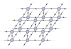
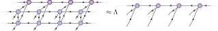

```@meta
EditURL = "../../../../examples/boundary_mps/main.jl"
```

[](https://mybinder.org/v2/gh/QuantumKitHub/PEPSKit.jl/gh-pages?filepath=dev/examples/boundary_mps/main.ipynb)
[](https://nbviewer.jupyter.org/github/QuantumKitHub/PEPSKit.jl/blob/gh-pages/dev/examples/boundary_mps/main.ipynb)
[](https://minhaskamal.github.io/DownGit/#/home?url=https://github.com/QuantumKitHub/PEPSKit.jl/examples/tree/gh-pages/dev/examples/boundary_mps)


# [Boundary MPS contractions of 2D networks] (@id e_boundary_mps)

Instead of using CTMRG to contract the network encoding the norm of an infinite PEPS, one
can also use so-called [boundary MPS methods](@cite haegeman_diagonalizing_2017) to contract
this network. In this example, we will demonstrate how to use [the VUMPS algorithm](@cite
vanderstraeten_tangentspace_2019) to do so.

Before we start, we'll fix the random seed for reproducability:

````julia
using Random
Random.seed!(29384293742893);
````

Besides `TensorKit` and `PEPSKit`, here we also need to load the
[`MPSKit.jl`](https://quantumkithub.github.io/MPSKit.jl/stable/) package which implements a
host of tools for working with 1D matrix product states (MPS), including the VUMPS
algorithm:

````julia
using TensorKit, PEPSKit, MPSKit
````

## Computing a PEPS norm

We start by initializing a random infinite PEPS. Let us use normally distributed complex
entries using `randn`:

````julia
ψ = InfinitePEPS(randn, ComplexF64, ComplexSpace(2), ComplexSpace(2))
````

````
InfinitePEPS{TensorKit.TensorMap{ComplexF64, TensorKit.ComplexSpace, 1, 4, Vector{ComplexF64}}}(TensorKit.TensorMap{ComplexF64, TensorKit.ComplexSpace, 1, 4, Vector{ComplexF64}}[TensorMap(ℂ^2 ← (ℂ^2 ⊗ ℂ^2 ⊗ (ℂ^2)' ⊗ (ℂ^2)')):
[:, :, 1, 1, 1] =
 -0.5524390176345264 - 0.07357188568178248im  0.34014501646081047 - 0.7552574870030472im
 -0.5455245317233405 + 0.8946618856309984im     1.249282911658007 + 0.45352274131986825im

[:, :, 2, 1, 1] =
    0.33621043661988675 + 0.4400876608299719im   -0.9866664087107284 - 0.28688827761325675im
 -0.0077250067072679235 + 1.7380910495900947im  -0.19071062901939098 - 1.1367500834118434im

[:, :, 1, 2, 1] =
 -0.09149850722392933 + 0.3560942836258964im      1.6255618447281441 - 0.5689426732891244im
 -0.19309251474097275 - 0.32363899914302613im  -0.025356816648697236 + 0.5632279168368712im

[:, :, 2, 2, 1] =
 0.07675114584269166 - 0.011479824536308164im  -0.17779977372973318 + 1.1379201927122535im
 -1.0116302866282385 - 0.9253070687198848im      1.1649047337212566 + 0.9936369101208083im

[:, :, 1, 1, 2] =
  0.2510676919806213 - 0.182052326055189im   -0.5792402993550532 - 0.4309109406268341im
 0.04501645227038913 - 0.8140971172854408im  -0.5608346802110794 + 0.21262550530307248im

[:, :, 2, 1, 2] =
  1.5061767210554262 + 0.17190948125245623im  -0.8001234458239143 + 0.6764943808639017im
 -0.8176938467062373 - 0.40919675695722396im  -0.6692181340575689 + 0.6923370271564298im

[:, :, 1, 2, 2] =
 -0.16556382071485704 + 0.2540132491548349im   0.05546115732751907 + 0.3723175507964387im
 -0.29883021417599165 - 0.07229462525164528im   -1.200173153698329 - 0.45509299328832953im

[:, :, 2, 2, 2] =
  0.289873563752043 + 0.44718981087960125im  0.018357838612906643 + 0.9634127683557584im
 0.5128282969211142 - 0.2865462937979091im   -0.44278618042821827 + 0.2612084385439659im
;;])
````

To compute its norm, we have to contract a double-layer network which encodes the bra-ket
PEPS overlap ``\langle ψ | ψ \rangle``:

```@raw html
<center>

</center>
```

In PEPSKit.jl, this structure is represented as an [`InfiniteSquareNetwork`](@ref) object,
whose effective local rank-4 constituent tensor is given by the contraction of a pair of bra
and ket [`PEPSKit.PEPSTensor`](@ref)s across their physical legs. Until now, we have always
contracted such a network using the CTMRG algorithm. Here however, we will use another
approach.

If we take out a single row of this infinite norm network, we can interpret it as a 1D
row-to-row transfer operator ``\mathbb{T}``,

```@raw html
<center>

</center>
```

This transfer operator can be seen as an infinite chain of the effective local rank-4
tensors that make up the PEPS norm network. Since the network we want to contract can be
interpreted as the infinite power of ``\mathbb{T}``, we can contract it by finding its
leading eigenvector as a 1D MPS ``| \psi_{\text{MPS}} \rangle``, which we call the boundary
MPS. This boundary MPS should satisfy the eigenvalue equation
``\mathbb{T} | \psi_{\text{MPS}} \rangle \approx \Lambda | \psi_{\text{MPS}} \rangle``, or
diagrammatically:

```@raw html
<center>

</center>
```

Note that if ``\mathbb{T}`` is Hermitian, we can formulate this eigenvalue equation in terms of a
variational problem for the free energy,

```math
\begin{align}
f &= \lim_{N \to ∞} - \frac{1}{N} \log \left( \frac{\langle \psi_{\text{MPS}} | \mathbb{T} | \psi_{\text{MPS}} \rangle}{\langle \psi_{\text{MPS}} | \psi_{\text{MPS}} \rangle} \right),
\\
&= -\log(\lambda)
\end{align}
```

where ``\lambda = \Lambda^{1/N}`` is the 'eigenvalue per site' of ``\mathbb{T}``, giving
``f`` the meaning of a free energy density.

Since the contraction of a PEPS norm network is in essence exactly the same problem as the
contraction of a 2D classical partition function, we can directly use boundary MPS
algorithms designed for 2D statistical mechanics models in this context. In particular,
we'll use the [the VUMPS algorithm](@cite vanderstraeten_tangentspace_2019) to perform the
boundary MPS contraction, and we'll call it through the [`leading_boundary`](@ref) method
from MPSKit.jl. This method precisely finds the MPS fixed point of a 1D transfer operator.

## Boundary MPS contractions with PEPSKit.jl

To use [`leading_boundary`](@ref), we first need to contruct the transfer operator
``\mathbb{T}`` as an [`MPSKit.InfiniteMPO`](@extref) object. In PEPSKit.jl, we can directly
construct the transfer operator corresponding to a PEPS norm network from a given infinite
PEPS as an [`InfiniteTransferPEPS`](@ref) object, which is a specific kind of
[`MPSKit.InfiniteMPO`](@extref).

To construct a 1D transfer operator from a 2D PEPS state, we need to specify which direction
should be facing north (`dir=1` corresponding to north, counting clockwise) and which row of
the network is selected from the north - but since we have a trivial unit cell there is only
one row here:

````julia
dir = 1 ## does not rotate the partition function
row = 1
T = InfiniteTransferPEPS(ψ, dir, row)
````

````
single site MPSKit.InfiniteMPO{Tuple{TensorKit.TensorMap{ComplexF64, TensorKit.ComplexSpace, 1, 4, Vector{ComplexF64}}, TensorKit.TensorMap{ComplexF64, TensorKit.ComplexSpace, 1, 4, Vector{ComplexF64}}}}:
╷  ⋮
┼ O[1]: (TensorMap(ℂ^2 ← (ℂ^2 ⊗ ℂ^2 ⊗ (ℂ^2)' ⊗ (ℂ^2)')), TensorMap(ℂ^2 ← (ℂ^2 ⊗ ℂ^2 ⊗ (ℂ^2)' ⊗ (ℂ^2)')))
╵  ⋮

````

Since we'll find the leading eigenvector of ``\mathbb{T}`` as a boundary MPS, we first need
to construct an initial guess to supply to our algorithm. We can do this using the
[`initialize_mps`](@ref) function, which constructs a random MPS with a specific virtual
space for a given transfer operator. Here, we'll build an initial guess for the boundary MPS
with a bond dimension of 20:

````julia
mps₀ = initialize_mps(T, [ComplexSpace(20)])
````

````
single site InfiniteMPS:
│   ⋮
│ C[1]: TensorMap(ℂ^20 ← ℂ^20)
├── AL[1]: TensorMap((ℂ^20 ⊗ ℂ^2 ⊗ (ℂ^2)') ← ℂ^20)
│   ⋮

````

Note that this will just construct a MPS with random Gaussian entries based on the physical
spaces of the supplied transfer operator. Of course, one might come up with a better initial
guess (leading to better convergence) depending on the application. To find the leading
boundary MPS fixed point, we call [`leading_boundary`](@ref) using the
[`MPSKit.VUMPS`](@extref) algorithm:

````julia
mps, env, ϵ = leading_boundary(mps₀, T, VUMPS(; tol = 1.0e-6, verbosity = 2));
````

````
[ Info: VUMPS init:	obj = +1.674563752306e+00 +3.035692829590e+00im	err = 7.5576e-01
[ Info: VUMPS conv 120:	obj = +6.831610878310e+00 -9.694385865125e-09im	err = 9.5145748821e-07	time = 7.42 sec

````

The norm of the state per unit cell is then given by the expectation value
$\langle \psi_\text{MPS} | \mathbb{T} | \psi_\text{MPS} \rangle$ per site:

````julia
norm_vumps = abs(prod(expectation_value(mps, T)))
````

````
6.831610878309698
````

This can be compared to the result obtained using CTMRG, where we see that the results
match:

````julia
env_ctmrg, = leading_boundary(CTMRGEnv(ψ, ComplexSpace(20)), ψ; tol = 1.0e-6, verbosity = 2)
norm_ctmrg = abs(norm(ψ, env_ctmrg))
@show abs(norm_vumps - norm_ctmrg) / norm_vumps;
````

````
[ Info: CTMRG init:	obj = -1.495741317009e+01 +3.091851579631e-01im	err = 1.0000e+00
[ Info: CTMRG conv 30:	obj = +6.831603585666e+00	err = 6.2262595139e-07	time = 0.40 sec
abs(norm_vumps - norm_ctmrg) / norm_vumps = 1.0674852575113105e-6

````

## Working with unit cells

For PEPS with non-trivial unit cells, the principle is exactly the same. The only difference
is that now the transfer operator of the PEPS norm partition function has multiple rows or
'lines', each of which can be represented by an [`InfiniteTransferPEPS`](@ref) object. Such
a multi-line transfer operator is represented by a [`PEPSKit.MultilineTransferPEPS`](@ref)
object. In this case, the boundary MPS is an [`MultilineMPS`](@extref) object, which should
be initialized by specifying a virtual space for each site in the partition function unit
cell.

First, we construct a PEPS with a $2 \times 2$ unit cell using the `unitcell` keyword
argument and then define the corresponding transfer operator, where we again specify the
direction which will be facing north:

````julia
ψ_2x2 = InfinitePEPS(rand, ComplexF64, ComplexSpace(2), ComplexSpace(2); unitcell = (2, 2))
T_2x2 = PEPSKit.MultilineTransferPEPS(ψ_2x2, dir);
````

Now, the procedure is the same as before: We compute the norm once using VUMPS, once using CTMRG and then compare.

````julia
mps₀_2x2 = initialize_mps(T_2x2, fill(ComplexSpace(20), 2, 2))
mps_2x2, = leading_boundary(mps₀_2x2, T_2x2, VUMPS(; tol = 1.0e-6, verbosity = 2))
norm_2x2_vumps = abs(prod(expectation_value(mps_2x2, T_2x2)))

env_ctmrg_2x2, = leading_boundary(
    CTMRGEnv(ψ_2x2, ComplexSpace(20)), ψ_2x2; tol = 1.0e-6, verbosity = 2
)
norm_2x2_ctmrg = abs(norm(ψ_2x2, env_ctmrg_2x2))

@show abs(norm_2x2_vumps - norm_2x2_ctmrg) / norm_2x2_vumps;
````

````
[ Info: VUMPS init:	obj = +8.149302834396e+02 -8.860408249120e+01im	err = 8.6172e-01
┌ Warning: VUMPS cancel 200:	obj = +1.046992011815e+05 -2.212181695361e+00im	err = 6.9503579749e-03	time = 13.67 sec
└ @ MPSKit ~/.julia/packages/MPSKit/cKwp2/src/algorithms/groundstate/vumps.jl:76
[ Info: CTMRG init:	obj = -1.240261729401e+02 -1.672150510263e+01im	err = 1.0000e+00
[ Info: CTMRG conv 47:	obj = +1.046633714846e+05	err = 1.6991268013e-07	time = 1.84 sec
abs(norm_2x2_vumps - norm_2x2_ctmrg) / norm_2x2_vumps = 0.00034221579358038244

````

Again, the results are compatible. Note that for larger unit cells and non-Hermitian PEPS
[the VUMPS algorithm may become unstable](@cite vanderstraeten_variational_2022), in which
case the CTMRG algorithm is recommended.

## Contracting PEPO overlaps

Using exactly the same machinery, we can contract 2D networks which encode the expectation
value of a PEPO for a given PEPS state. As an example, we can consider the overlap of the
PEPO correponding to the partition function of [3D classical Ising model](@ref e_3d_ising)
with our random PEPS from before and evaluate the overlap $\langle \psi |
T | \psi \rangle$.

The classical Ising PEPO is defined as follows:

````julia
function ising_pepo(β; unitcell = (1, 1, 1))
    t = ComplexF64[exp(β) exp(-β); exp(-β) exp(β)]
    q = sqrt(t)

    O = zeros(2, 2, 2, 2, 2, 2)
    O[1, 1, 1, 1, 1, 1] = 1
    O[2, 2, 2, 2, 2, 2] = 1
    @tensor o[-1 -2; -3 -4 -5 -6] :=
        O[1 2; 3 4 5 6] * q[-1; 1] * q[-2; 2] * q[-3; 3] * q[-4; 4] * q[-5; 5] * q[-6; 6]
    O = TensorMap(o, ℂ^2 ⊗ (ℂ^2)' ← ℂ^2 ⊗ ℂ^2 ⊗ (ℂ^2)' ⊗ (ℂ^2)')

    return InfinitePEPO(O; unitcell)
end;
````

To evaluate the overlap, we instantiate the PEPO and the corresponding [`InfiniteTransferPEPO`](@ref)
in the right direction, on the right row of the partition function (trivial here):

````julia
T = ising_pepo(1)
transfer_pepo = InfiniteTransferPEPO(ψ, T, 1, 1)
````

````
single site MPSKit.InfiniteMPO{Tuple{TensorKit.TensorMap{ComplexF64, TensorKit.ComplexSpace, 1, 4, Vector{ComplexF64}}, TensorKit.TensorMap{ComplexF64, TensorKit.ComplexSpace, 1, 4, Vector{ComplexF64}}, TensorKit.TensorMap{ComplexF64, TensorKit.ComplexSpace, 2, 4, Vector{ComplexF64}}}}:
╷  ⋮
┼ O[1]: (TensorMap(ℂ^2 ← (ℂ^2 ⊗ ℂ^2 ⊗ (ℂ^2)' ⊗ (ℂ^2)')), TensorMap(ℂ^2 ← (ℂ^2 ⊗ ℂ^2 ⊗ (ℂ^2)' ⊗ (ℂ^2)')), TensorMap((ℂ^2 ⊗ (ℂ^2)') ← (ℂ^2 ⊗ ℂ^2 ⊗ (ℂ^2)' ⊗ (ℂ^2)')))
╵  ⋮

````

As before, we converge the boundary MPS using VUMPS and then compute the expectation value:

````julia
mps₀_pepo = initialize_mps(transfer_pepo, [ComplexSpace(20)])
mps_pepo, = leading_boundary(mps₀_pepo, transfer_pepo, VUMPS(; tol = 1.0e-6, verbosity = 2))
norm_pepo = abs(prod(expectation_value(mps_pepo, transfer_pepo)));
@show norm_pepo;
````

````
[ Info: VUMPS init:	obj = +2.655321432467e+01 +3.760603778362e-01im	err = 8.9759e-01
┌ Warning: VUMPS cancel 200:	obj = +7.226394646816e+01 +6.223361199138e+00im	err = 5.7986634490e-01	time = 37.47 sec
└ @ MPSKit ~/.julia/packages/MPSKit/cKwp2/src/algorithms/groundstate/vumps.jl:76
norm_pepo = 72.5314289378628

````

These objects and routines can be used to optimize PEPS fixed points of 3D partition
functions, see for example [Vanderstraeten et al.](@cite vanderstraeten_residual_2018)

---

*This page was generated using [Literate.jl](https://github.com/fredrikekre/Literate.jl).*

